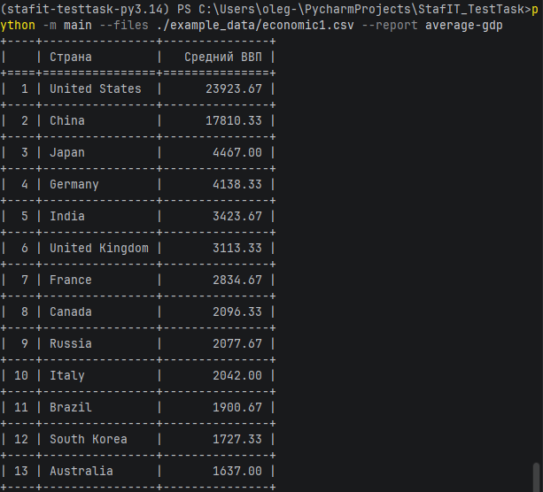
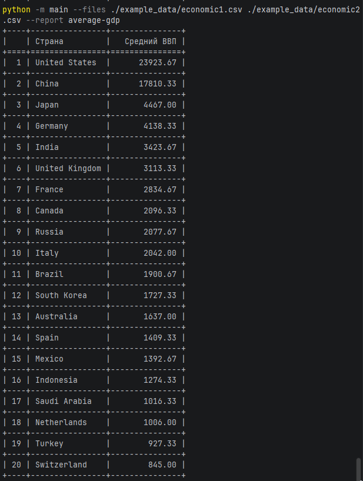

# Анализатор макроэкономических данных

Проект для обработки CSV-файлов с макроэкономическими показателями и генерации аналитических отчетов.

## Быстрый старт

### Установка
```bash
# Клонирование репозитория
git clone https://github.com/soulbratan/StafIt_TestTask.git
````
```bash
# Установка зависимостей (используется Poetry)
poetry install
```
```bash
# Активация виртуального окружения
poetry shell
```
### Использование

```bash
# Запуск с одним файлом
python -m main --files ./example_data/economic1.csv --report average-gdp   
```
```bash
# Запуск с несколькими файлами
python -m main --files ./example_data/economic1.csv ./example_data/economic2.csv --report average-gdp   
```

## Возможности

- Чтение данных из одного или нескольких CSV-файлов;
- Расчет среднего ВВП по странам;
- Автоматическая сортировка по убыванию показателей;
- Табличный вывод в консоль;
- Возможность добавления генерации отчетов;
- Обработка ошибок и валидация входных данных.

### Параметры командной строки

1) --files — Пути к CSV-файлам с данными (обязательный, список)
2) --report — Тип генерируемого отчета (обязательный, строка)

## Примеры работы скрипта
---------------------Пример работы чтения одного файла---------------------


---------------------Пример работы чтения двух файлов---------------------



## Тестирование
```bash
# Запуск всех тестов
poetry run pytest
```

```bash
# Запуск тестов с покрытием кода
poetry run pytest --cov
```


## Контакты

### Разработчик
** Скрипников О.В.**

### Способы связи
- **Email:** [osv719@gmail.com]
- **GitHub:** [GitHub профиль](https://github.com/soulbratan)